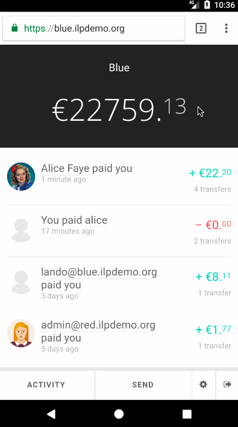
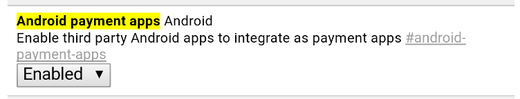

# Interledger Payment App Example

This is a project that was done as part of a hack-o-thon organized at the [Interledger Workshop at Blockchain Expo](https://www.eventbrite.com/e/interledger-workshop-at-blockchain-expo-1-2-june-berlin-tickets-34221014977). This repo is meant as a showcase of an Android payment app, using the Interledger spec for payment.

As such, it contains both the website implementation of the [Payment Request](https://www.w3.org/TR/payment-request) and a Payment App itself. It does **not** contain the ledger implementations. These are hardcoded to use https://red.ilpdemo.org and https://blue.ilpdemo.org as originating and the destination ledgers. Both are running the NodeJS [ILP kit](https://github.com/interledgerjs/ilp-kit) and have been implemented as an initiative to show off the Interledger spec.

## Context

In order for the Payment App to be presented as a payment choice for the user through the Payment Request sheet, two conditions have to be met:

1. The website using Payment Request has to specify an [Interledger Payment Method](https://w3c.github.io/webpayments/proposals/interledger-payment-method.html)
2. A payment app with an Interledger payment method has to be exposed to the browser

As of writing, only [Chrome Canary 60+](https://codereview.chromium.org/2850503002) supports Payment Apps and the Interledger payment method. These Payment Apps are automatically discovered by Android when they expose an `intent-filter` as such: https://github.com/Shopify/interledger-payment-app-example/blob/9cab508fc6ed383b6949c341c338a04cc652a64a/PaymentApp/app/src/main/AndroidManifest.xml#L23.

Once the buyer initiates a Payment Request, if the buyer's and provider's payment method intersect, he'll get presented a payment sheet where he can provide his information, choose a Shipping Method and a payment method. Once the user choses the Payment App through the payment sheet and proceeds to pay, the sheet then transfers control to the Payment App, which deals with the payment.

For more information, you can read up on:

- [Payment Request spec](https://www.w3.org/TR/payment-request)
- [Payment Handler API spec](https://w3c.github.io/payment-handler), which deals with how to register Payment App in the browser
- [Interledger website](https://interledger.org), which contains all the information needed about Interledger
- [Android payment app integration into Android web browsers](https://docs.google.com/document/d/1izV4uC-tiRJG3JLooqY3YRLU22tYOsLTNq0P_InPJeE/edit), for a quick overview of the interaction between `PaymentRequest` and a `PaymentApp`

This repo focuses on Google's beta implementation of Payment App's on Android, through Chrome Canary 60+.

## Demo



This demo shows off transferring an amount from ledger **alice@red.ilpdemo.org** to **alice@blue.ilpdemo.org**.

## Some assumptions

As with any project in a hack-o-thon, a few shortcuts were taken for simplicity:

1. The app has hardcoded user credentials for the originating ledger (see: https://github.com/Shopify/interledger-payment-app-example/blob/9cab508fc6ed383b6949c341c338a04cc652a64a/PaymentApp/app/src/main/java/com/shopify/paymentapp/Credentials.java#L8:L10); In a real world use case, the user would be expected to authenticate within the app to a third party ledger (a wallet for example)

2. Both the originating ledger ([red.ilpdemo.org](https://red.ilpdemo.org)) and the destination ledger ([blue.ilpdemo.org](https://blue.ilpdemo.org)) are instances of the NodeJS [ILP kit](https://github.com/interledgerjs/ilp-kit) and are not part of this repo. Both ledgers have each other as peers, and each one has a user named "Alice".

## Prerequisites

### Languages

- Python
- Java

### Libraries

- android-sdk

## Setup

1. Install the android system image used for the emulator

  ```
  sdkmanager "system-images;android-25;google_apis;x86"
  ```

2. Install Android platform tools

  ```
  sdkmanager "platforms;android-25"
  ```

3. Create the Android emulator using the Pixel XL image

  ```
  avdmanager create avd --package "system-images;android-25;google_apis;x86" --name "payment-app-device" --tag "google_apis" -d "pixel_xl"
  ```

4. Enable hardware keyboard in the emulator config, for sanity

  ```
  sed -ie 's/hw\.keyboard=no/hw\.keyboard=yes/g' ~/.android/avd/payment-app-device.avd/config.ini
  ```

5. Appending some additional Android emulator configurations

  ```
  echo "showDeviceFrame=yes\nskin.name=1440x2560\nhw.gpu.enabled=yes\nhw.gpu.mode=host" >> ~/.android/avd/payment-app-device.avd/config.ini
  ```

6. Finish setup of the emulator by:

    1. Running the emulator

    ```
    ./bin/start_emulator
    ```

    2. In a separate window, running

    ```
    ./bin/setup_emulator
    ```  

7. Then, in the Android emulator, launch **Chrome Canary**

8. Visit `chrome://flags/#android-payment-apps`

9. Enable the Android Payment Apps beta flag as such:

  

10. Close the emulator

## Playing around

For simplicity, we'll refer to the website that implements `PaymentRequest` as an online store.

**Important:** You'll have to find a way to serve the online store through HTTPS, as `PaymentRequest` only works with SSL. There's a few ways of doing this, but the easier way is to use a proxy or tunneling service (like [Ngrok](https://ngrok.com)).

1. Start the online store

  ```
  ./bin/start_online_store
  ```

2. Somehow enable SSL for said online store (through a proxy or tunneling service, as explained higher up)

3. Start the emulator

  ```
  ./bin/start_emulator
  ```

4. Open up Chrome Canary and visit the online store URL (remember, it has to support SSL)

5. Click on **Buy**
